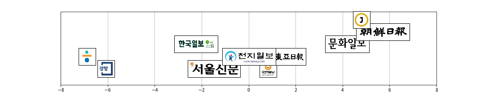

# political_bias_kr
한국 대표 일간지의 진보/보수/중도의 사설을 수집하여, 키워드 분석 및 미디어지형을 그리기 위한 지표를 선정합니다.

### 일간지 리스트
1. 경향신문
2. 한겨레
3. 국민일보
4. 동아일보
5. 문화일보
6. 조선일보
7. 중앙일보
8. 서울신문
9. 천지일보
10. 한국일보
### 사용 라이브러리
- mecab
- pandas
- matplotlib
- requests

### 수집 및 사용 데이터
[진보/보수/중도 사설기사 수집 데이터](https://drive.google.com/drive/folders/1c9udXs1BtiI28cZwQnU5CqTb3f_6h_cq?usp=sharing)
### 한국 대표일간지 미디어지형
